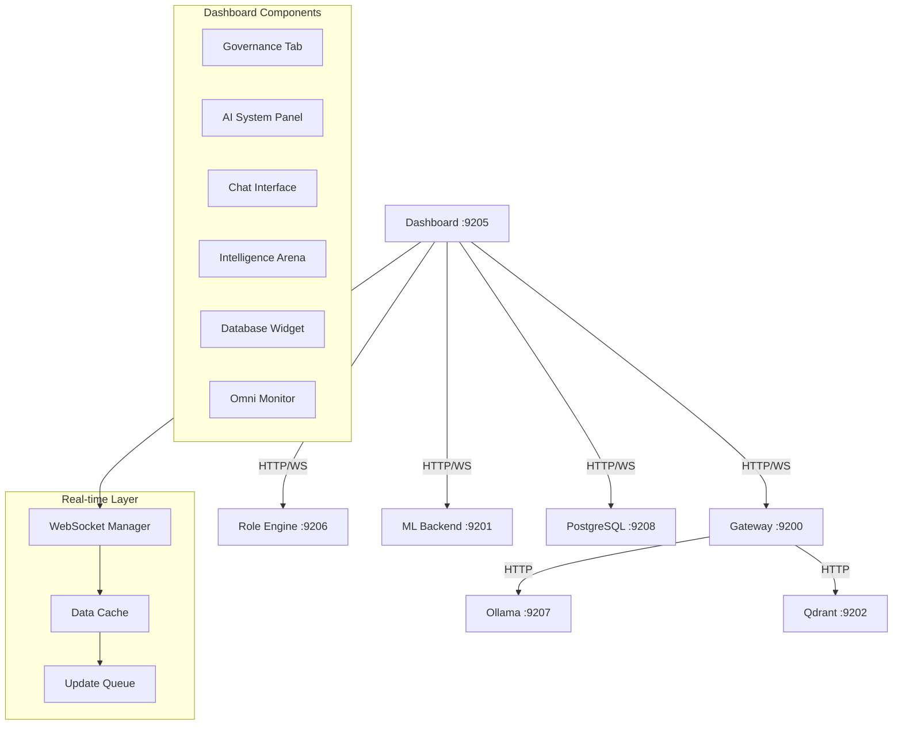
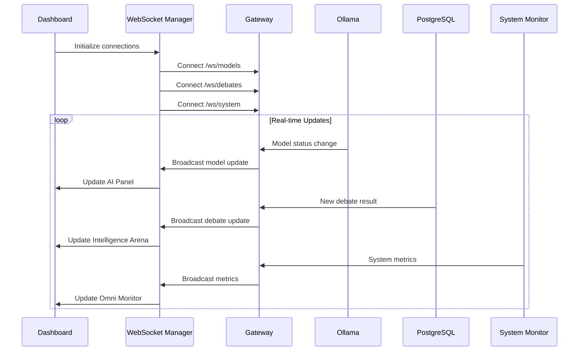

# Dashboard Operational Fixes - Design Document

**Project Creator:** Herman Swanepoel  
**Document Version:** 1.0  
**Last Updated:** December 13, 2025

## Overview

This design addresses critical operational issues in the Aura IA MCP Dashboard V3 "Grand Unification" that prevent users from accessing real-time system data and functionality. The solution implements a comprehensive fix covering governance data loading, model status display, chat performance optimization, real-time monitoring with WebSocket integration, and enhanced error handling.

The design maintains compatibility with the existing HNSC architecture while adding robust real-time capabilities and improved data integration across all dashboard components.

## Architecture

### Current System Integration Points



### WebSocket Architecture



## Components and Interfaces

### 1. WebSocket Manager (Frontend)

**Location:** `dashboard/assets/websocket-manager.js`

```javascript
class WebSocketManager {
    constructor() {
        this.connections = new Map();
        this.reconnectAttempts = new Map();
        this.maxReconnectAttempts = 5;
        this.reconnectDelay = 1000; // Start with 1 second
    }
    
    connect(endpoint, onMessage, onError) {
        // Establish WebSocket connection with auto-reconnect
    }
    
    disconnect(endpoint) {
        // Clean disconnect with proper cleanup
    }
    
    send(endpoint, data) {
        // Send data with connection validation
    }
    
    handleReconnect(endpoint) {
        // Exponential backoff reconnection logic
    }
}
```

### 2. Enhanced Backend APIs

#### A. Governance API Enhancement (`ops/role_engine/are_service.py`)

```python
@app.websocket("/ws/governance")
async def governance_websocket(websocket: WebSocket):
    await websocket.accept()
    try:
        while True:
            # Send role hierarchy updates
            roles = await get_role_hierarchy()
            audit_logs = await get_recent_audit_logs()
            
            await websocket.send_json({
                "type": "governance_update",
                "roles": roles,
                "audit_logs": audit_logs,
                "timestamp": datetime.utcnow().isoformat()
            })
            
            await asyncio.sleep(5)  # Update every 5 seconds
    except WebSocketDisconnect:
        pass

@app.get("/api/governance/roles")
async def get_role_hierarchy():
    # Return complete role hierarchy with capabilities
    pass

@app.get("/api/governance/audit-logs")
async def get_recent_audit_logs(limit: int = 50):
    # Return recent security audit events
    pass
```

#### B. Model Status API Enhancement (`src/mcp_server/ide_agents_mcp_server.py`)

```python
@app.websocket("/ws/models")
async def models_websocket(websocket: WebSocket):
    await websocket.accept()
    try:
        while True:
            # Get real-time model status from Ollama
            status = await get_ollama_model_status()
            lifecycle_info = await get_model_lifecycle_info()
            
            await websocket.send_json({
                "type": "model_update",
                "loaded_models": status.get("loaded_models", []),
                "available_models": status.get("available_models", []),
                "memory_usage": lifecycle_info.get("memory_usage", {}),
                "model_stats": await get_model_performance_stats(),
                "timestamp": datetime.utcnow().isoformat()
            })
            
            await asyncio.sleep(3)  # Update every 3 seconds
    except WebSocketDisconnect:
        pass

async def get_ollama_model_status():
    # Query Ollama API for current model status
    async with httpx.AsyncClient() as client:
        response = await client.get("http://aura-ia-ollama:11434/api/tags")
        return response.json()

async def get_model_performance_stats():
    # Query PostgreSQL for model debate statistics
    pass
```

#### C. System Monitoring API (`aura_ia_mcp/services/system_monitor.py`)

```python
import psutil
import GPUtil
from typing import Dict, Optional

class SystemMonitor:
    def __init__(self):
        self.gpu_available = self._check_gpu_availability()
    
    def _check_gpu_availability(self) -> bool:
        try:
            import GPUtil
            return len(GPUtil.getGPUs()) > 0
        except:
            return False
    
    async def get_system_metrics(self) -> Dict:
        metrics = {
            "cpu": {
                "usage_percent": psutil.cpu_percent(interval=1),
                "count": psutil.cpu_count(),
                "frequency": psutil.cpu_freq()._asdict() if psutil.cpu_freq() else None
            },
            "memory": {
                "total": psutil.virtual_memory().total,
                "available": psutil.virtual_memory().available,
                "percent": psutil.virtual_memory().percent,
                "used": psutil.virtual_memory().used
            },
            "disk": {
                "total": psutil.disk_usage('/').total,
                "used": psutil.disk_usage('/').used,
                "free": psutil.disk_usage('/').free,
                "percent": psutil.disk_usage('/').percent
            },
            "network": self._get_network_stats(),
            "timestamp": datetime.utcnow().isoformat()
        }
        
        if self.gpu_available:
            metrics["gpu"] = self._get_gpu_stats()
        
        # Add temperature monitoring if available
        try:
            temps = psutil.sensors_temperatures()
            if temps:
                metrics["temperature"] = self._format_temperature_data(temps)
        except:
            pass
        
        return metrics
    
    def _get_gpu_stats(self) -> Dict:
        try:
            gpus = GPUtil.getGPUs()
            return [{
                "id": gpu.id,
                "name": gpu.name,
                "load": gpu.load * 100,
                "memory_used": gpu.memoryUsed,
                "memory_total": gpu.memoryTotal,
                "memory_percent": (gpu.memoryUsed / gpu.memoryTotal) * 100,
                "temperature": gpu.temperature
            } for gpu in gpus]
        except:
            return []

@app.websocket("/ws/system")
async def system_websocket(websocket: WebSocket):
    monitor = SystemMonitor()
    await websocket.accept()
    
    try:
        while True:
            metrics = await monitor.get_system_metrics()
            await websocket.send_json({
                "type": "system_update",
                "metrics": metrics
            })
            await asyncio.sleep(2)  # Update every 2 seconds
    except WebSocketDisconnect:
        pass
```

#### D. Database Monitoring API (`aura_ia_mcp/services/database_monitor.py`)

```python
class DatabaseMonitor:
    def __init__(self, db_url: str):
        self.db_url = db_url
    
    async def get_database_metrics(self) -> Dict:
        async with asyncpg.connect(self.db_url) as conn:
            # Get connection count
            active_connections = await conn.fetchval(
                "SELECT count(*) FROM pg_stat_activity WHERE state = 'active'"
            )
            
            # Get database size
            db_size = await conn.fetchval(
                "SELECT pg_size_pretty(pg_database_size(current_database()))"
            )
            
            # Get table sizes
            table_sizes = await conn.fetch("""
                SELECT schemaname, tablename, 
                       pg_size_pretty(pg_total_relation_size(schemaname||'.'||tablename)) as size
                FROM pg_tables 
                WHERE schemaname = 'public'
                ORDER BY pg_total_relation_size(schemaname||'.'||tablename) DESC
            """)
            
            # Get recent query performance
            slow_queries = await conn.fetch("""
                SELECT query, calls, total_time, mean_time
                FROM pg_stat_statements 
                WHERE mean_time > 100
                ORDER BY mean_time DESC 
                LIMIT 10
            """)
            
            return {
                "connection_count": active_connections,
                "database_size": db_size,
                "table_sizes": [dict(row) for row in table_sizes],
                "slow_queries": [dict(row) for row in slow_queries],
                "timestamp": datetime.utcnow().isoformat()
            }

@app.websocket("/ws/database")
async def database_websocket(websocket: WebSocket):
    monitor = DatabaseMonitor(os.getenv("DATABASE_URL"))
    await websocket.accept()
    
    try:
        while True:
            metrics = await monitor.get_database_metrics()
            await websocket.send_json({
                "type": "database_update",
                "metrics": metrics
            })
            await asyncio.sleep(10)  # Update every 10 seconds
    except WebSocketDisconnect:
        pass
```

### 3. Enhanced Frontend Components

#### A. Governance Tab Enhancement (`dashboard/index.html`)

```html
<div id="governance-container" class="tab-content">
    <div class="governance-grid">
        <div class="role-hierarchy-panel">
            <h3>Role Hierarchy</h3>
            <div id="role-tree-container">
                <div class="loading-spinner">Loading roles...</div>
            </div>
            <button id="refresh-roles-btn" class="btn btn-secondary">Refresh Roles</button>
        </div>
        
        <div class="audit-log-panel">
            <h3>Security Audit Log</h3>
            <div class="audit-controls">
                <select id="audit-filter">
                    <option value="all">All Events</option>
                    <option value="error">Errors Only</option>
                    <option value="warning">Warnings</option>
                    <option value="info">Info</option>
                </select>
                <button id="refresh-audit-btn" class="btn btn-secondary">Refresh</button>
            </div>
            <div id="audit-log-container">
                <table id="audit-log-table">
                    <thead>
                        <tr>
                            <th>Timestamp</th>
                            <th>Level</th>
                            <th>Event</th>
                            <th>Details</th>
                        </tr>
                    </thead>
                    <tbody id="audit-log-body">
                        <tr><td colspan="4" class="loading">Loading audit logs...</td></tr>
                    </tbody>
                </table>
            </div>
        </div>
    </div>
</div>
```

#### B. Enhanced AI System Panel (`dashboard/assets/app.js`)

```javascript
class AISystemPanel {
    constructor() {
        this.wsManager = new WebSocketManager();
        this.modelData = null;
        this.initializeWebSocket();
    }
    
    initializeWebSocket() {
        this.wsManager.connect(
            'ws://{{NAS_IP}}:9200/ws/models',
            (data) => this.handleModelUpdate(data),
            (error) => this.handleConnectionError(error)
        );
    }
    
    handleModelUpdate(data) {
        if (data.type === 'model_update') {
            this.modelData = data;
            this.updateDisplay();
        }
    }
    
    updateDisplay() {
        const container = document.getElementById('ai-system-status');
        if (!this.modelData || !this.modelData.loaded_models.length) {
            container.innerHTML = `
                <div class="no-models">
                    <i class="fas fa-robot"></i>
                    <p>No models currently loaded</p>
                    <button onclick="loadDefaultModel()" class="btn btn-primary">Load Default Model</button>
                </div>
            `;
            return;
        }
        
        const modelsHtml = this.modelData.loaded_models.map(model => `
            <div class="model-card">
                <div class="model-header">
                    <h4>${model.name}</h4>
                    <span class="model-status active">Active</span>
                </div>
                <div class="model-stats">
                    <div class="stat">
                        <label>Memory:</label>
                        <span>${this.formatBytes(model.memory_usage || 0)}</span>
                    </div>
                    <div class="stat">
                        <label>Requests:</label>
                        <span>${model.request_count || 0}</span>
                    </div>
                </div>
            </div>
        `).join('');
        
        container.innerHTML = `
            <div class="models-grid">
                ${modelsHtml}
            </div>
            <div class="model-actions">
                <button onclick="refreshModels()" class="btn btn-secondary">Refresh</button>
                <button onclick="loadModel()" class="btn btn-primary">Load Model</button>
            </div>
        `;
    }
    
    formatBytes(bytes) {
        if (bytes === 0) return '0 Bytes';
        const k = 1024;
        const sizes = ['Bytes', 'KB', 'MB', 'GB'];
        const i = Math.floor(Math.log(bytes) / Math.log(k));
        return parseFloat((bytes / Math.pow(k, i)).toFixed(2)) + ' ' + sizes[i];
    }
}
```

## Data Models

### WebSocket Message Schema

```typescript
interface WebSocketMessage {
    type: 'model_update' | 'system_update' | 'database_update' | 'governance_update' | 'debate_update';
    timestamp: string;
    data: any;
}

interface ModelUpdateData {
    loaded_models: LoadedModel[];
    available_models: string[];
    memory_usage: Record<string, number>;
    model_stats: ModelStats[];
}

interface SystemMetrics {
    cpu: CPUMetrics;
    memory: MemoryMetrics;
    disk: DiskMetrics;
    network: NetworkMetrics;
    gpu?: GPUMetrics[];
    temperature?: TemperatureMetrics;
}

interface DatabaseMetrics {
    connection_count: number;
    database_size: string;
    table_sizes: TableSize[];
    slow_queries: SlowQuery[];
}
```

### Configuration Schema

```yaml
# config/dashboard_config.yaml
dashboard:
  websocket:
    enabled: true
    reconnect_attempts: 5
    reconnect_delay: 1000
    endpoints:
      - models
      - system
      - database
      - governance
      - debates
  
  monitoring:
    system_update_interval: 2000  # ms
    model_update_interval: 3000   # ms
    database_update_interval: 10000  # ms
    
  features:
    gpu_monitoring: auto  # auto, enabled, disabled
    temperature_monitoring: auto
    database_monitoring: true
    governance_monitoring: true
```

## Correctness Properties

*A property is a characteristic or behavior that should hold true across all valid executions of a system-essentially, a formal statement about what the system should do. Properties serve as the bridge between human-readable specifications and machine-verifiable correctness guarantees.*

### Property 1: Governance Data Loading
*For any* request to the governance tab, the dashboard should successfully fetch and display role hierarchy data from the Role Engine API within 5 seconds
**Validates: Requirements 1.1, 1.2**

### Property 2: Model Status Accuracy
*For any* AI System panel load, the displayed model information should match the actual status returned by the Ollama API
**Validates: Requirements 2.1, 2.2**

### Property 3: Chat Response Performance
*For any* chat message sent through any mode, the system should respond within 30 seconds or provide clear timeout handling
**Validates: Requirements 3.1**

### Property 4: Real-time Update Delivery
*For any* WebSocket connection, server data changes should be reflected in the dashboard within 2 seconds of the change occurring
**Validates: Requirements 7.2**

### Property 5: Database Monitoring Accuracy
*For any* database widget load, the displayed connection count and metrics should match the actual PostgreSQL server state
**Validates: Requirements 5.1, 5.2**

### Property 6: System Metrics Collection
*For any* system monitoring request, the returned CPU, RAM, and disk metrics should reflect actual server hardware state
**Validates: Requirements 6.1**

### Property 7: WebSocket Connection Management
*For any* dashboard session, WebSocket connections should be established on load and automatically reconnect on failure with exponential backoff
**Validates: Requirements 7.1, 7.3**

### Property 8: Error Logging Completeness
*For any* API failure or WebSocket disconnect, detailed error information should be logged to the browser console with sufficient debugging context
**Validates: Requirements 8.1, 8.2**

### Property 9: Intelligence Arena Data Integrity
*For any* model statistics display, the win rates and debate history should accurately reflect the data stored in PostgreSQL
**Validates: Requirements 4.2**

### Property 10: GPU Monitoring Conditional Display
*For any* system with GPU hardware available, the Omni Monitor should display GPU utilization, memory, and temperature data
**Validates: Requirements 6.2**

## Error Handling

### WebSocket Error Recovery

```javascript
class WebSocketErrorHandler {
    handleConnectionError(endpoint, error) {
        console.error(`WebSocket connection failed for ${endpoint}:`, error);
        
        // Show user-friendly error message
        this.showConnectionStatus(endpoint, 'disconnected', error.message);
        
        // Attempt reconnection with exponential backoff
        this.scheduleReconnect(endpoint);
        
        // Fall back to HTTP polling
        this.enablePollingFallback(endpoint);
    }
    
    showConnectionStatus(endpoint, status, message) {
        const statusIndicator = document.getElementById(`${endpoint}-status`);
        if (statusIndicator) {
            statusIndicator.className = `connection-status ${status}`;
            statusIndicator.textContent = message;
        }
    }
    
    enablePollingFallback(endpoint) {
        // Implement HTTP polling as fallback
        const pollInterval = setInterval(async () => {
            try {
                const data = await this.fetchDataHTTP(endpoint);
                this.handleDataUpdate(endpoint, data);
            } catch (error) {
                console.warn(`HTTP polling failed for ${endpoint}:`, error);
            }
        }, 10000); // Poll every 10 seconds
        
        this.pollingIntervals.set(endpoint, pollInterval);
    }
}
```

### API Error Handling

```python
async def safe_api_call(func, *args, **kwargs):
    """Wrapper for safe API calls with comprehensive error handling"""
    try:
        return await func(*args, **kwargs)
    except httpx.ConnectError as e:
        logger.error(f"Connection error in {func.__name__}: {e}")
        return {"error": "service_unavailable", "message": str(e)}
    except httpx.TimeoutException as e:
        logger.error(f"Timeout error in {func.__name__}: {e}")
        return {"error": "timeout", "message": "Request timed out"}
    except Exception as e:
        logger.error(f"Unexpected error in {func.__name__}: {e}")
        return {"error": "internal_error", "message": str(e)}
```

## Testing Strategy

### Unit Testing Approach

**Framework:** pytest with asyncio support for WebSocket testing

**Key Test Areas:**
- WebSocket connection management and reconnection logic
- API integration with all backend services
- Data transformation and display logic
- Error handling and fallback mechanisms

**Example Test:**
```python
async def test_model_status_websocket():
    """Test WebSocket model status updates"""
    # Setup mock Ollama API response
    mock_response = {
        "models": [{"name": "phi3.5:3.8b", "size": 3800000000}]
    }
    
    # Test WebSocket message handling
    with patch('httpx.AsyncClient.get') as mock_get:
        mock_get.return_value.json.return_value = mock_response
        
        # Verify WebSocket sends correct model data
        result = await get_ollama_model_status()
        assert result["models"][0]["name"] == "phi3.5:3.8b"
```

### Property-Based Testing Approach

**Framework:** Hypothesis for Python, fast-check for JavaScript

**Configuration:** Minimum 100 iterations per property test

**Property Test Examples:**

```python
from hypothesis import given, strategies as st

@given(st.text(min_size=1))
async def test_chat_response_time_property(message):
    """**Feature: dashboard-operational-fixes, Property 3: Chat Response Performance**"""
    start_time = time.time()
    response = await send_chat_message(message)
    end_time = time.time()
    
    # Property: All chat responses should complete within 30 seconds
    assert (end_time - start_time) < 30.0
    assert response is not None

@given(st.integers(min_value=0, max_value=100))
async def test_websocket_reconnection_property(failure_count):
    """**Feature: dashboard-operational-fixes, Property 7: WebSocket Connection Management**"""
    ws_manager = WebSocketManager()
    
    # Simulate connection failures
    for _ in range(failure_count):
        ws_manager.handle_connection_failure('test_endpoint')
    
    # Property: WebSocket should always attempt reconnection with exponential backoff
    assert ws_manager.reconnect_attempts.get('test_endpoint', 0) <= ws_manager.max_reconnect_attempts
    assert ws_manager.is_reconnecting('test_endpoint') or failure_count == 0
```

### Integration Testing

**Scope:** End-to-end testing of dashboard components with live backend services

**Test Environment:** Docker Compose stack with all services running

**Key Integration Tests:**
- Dashboard loads and displays data from all services
- WebSocket connections establish and receive updates
- Error scenarios trigger appropriate fallback behavior
- Performance requirements are met under normal load

### Browser Testing

**Framework:** Playwright for cross-browser testing

**Test Coverage:**
- WebSocket functionality across different browsers
- Real-time updates and UI responsiveness
- Error message display and user interactions
- Mobile responsiveness of enhanced components
